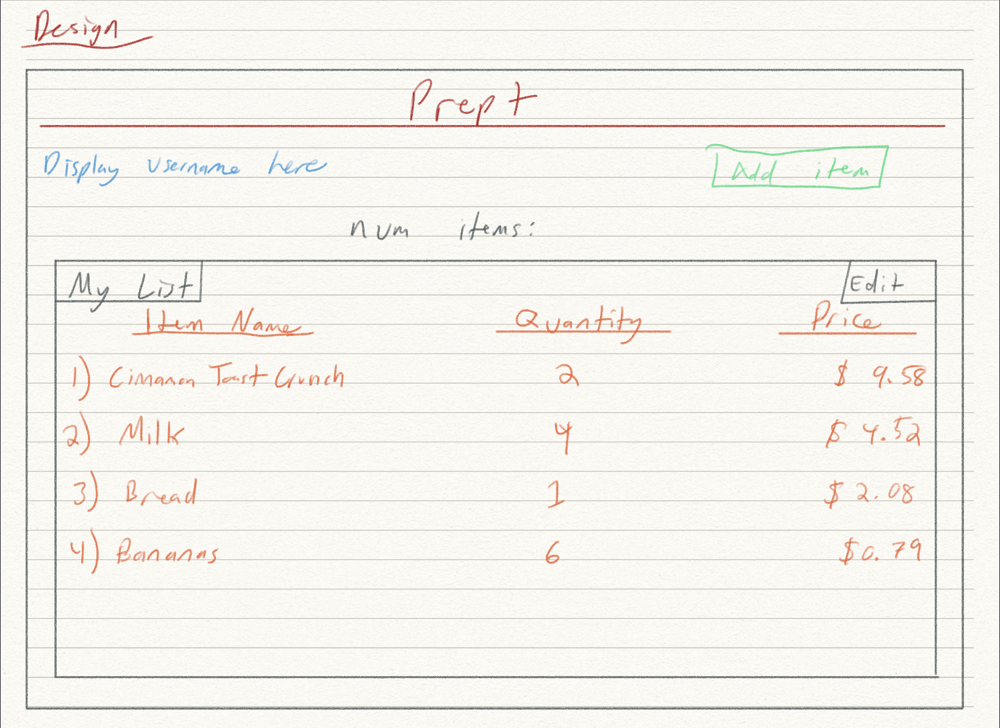
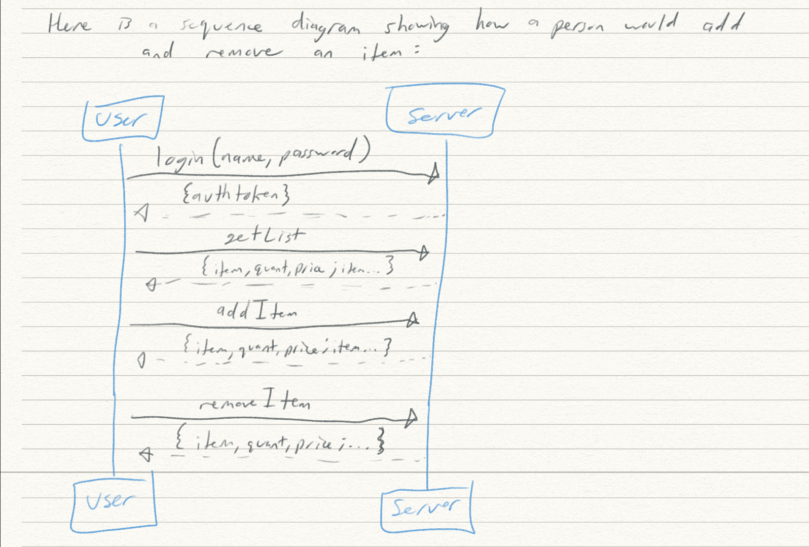

# startup

Repository for my cs260 project

#IMPORTANT: THE CODE FOR THE ACTUAL WEB APP IS CONTAINED IN THE ```startup_app``` DIRECTORY


#STARTUP SPECS:


##Elevator Pitch:
	How many times have you gone to the grocery store this year? How about this month? How 
many times did you find yourself wishing you had a list on your phone you could continually 
refer to so you could save yourself from listing all your groceries for each visit? With Prept, you 
only have to list out your groceries once! Then, let Prept do the tedious work of remembering your 
purchases. Oh, and did we mention you can do it all via barcode scanning?




Here is a sequence diagram:




##Key Features:
	- Secure login over HTTPS
	- Ability to create profile
	- Add items to a list (3 cols: item name, quantity, price)
	- Display list
	- Ability for a user to edit list
	- List persistently stored


##Technologies:
	###- HTML:
		- For this deliverable, I added the app structure 
		- HTML Pages: Uses correct HTML structure for the application. Three HTML pages. One for login, one for grocery list, and one for adding items. Login is the initial page
		- Links: The login page automatically links to the grocery list page. The grocery list page contains links to logout and to add an item. Each page has a link to my GitHub repository
		- Text: Each of the item names, quantities, and costs are represented by a textual description
		- Images: I included an image for the login page and the grocery list page. 
		- Login: Input box and submit button for login
		- Database: I'm still working on this one
		- WebSocket: I'm still working on this one 
	###- CSS:
		- Application styling that looks good on different screen sizes (desktop only for 
		now), uses good whitespace, color choice, and contrast.
	###- JavaScript:
		- Provides login, grocery list display, adding items, displaying list, backend 
		endpoint calls.
	###- Service:
		- Backend service with endpoints for:
			- login
			- retrieving list of items
			- adding items to list
	###- DB:
		- Store users and items/lists in database
	###- Login:
		- Register and login users. Credentials securely stored in database. Can't get past 
		login page until authenticated
	###- WebSocket:
		- Real time updates to list as soon as new item added
	###- React:
		- Application ported to use the React web framework

