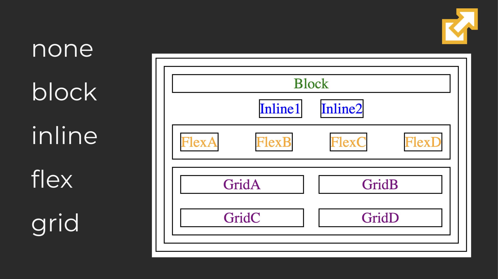

This is where my notes will go. 
This assignment was actually really fun. I have used Git a little bit at work, but very infrequently, so it is fun to 
have the chance to practice and gain experience with file manipulation within git. 

##KEY GIT COMMANDS:
git pull -- pulls a branch
git add -- 'stages' a change for commit
git commit -m "message here" -- Commits the changes
git push <branch-name> -- Pushes the changes to GitHub


#----------------------------------------------------------------------------------------------------------------------------
#						CLASS 5/11 -- CSS
#----------------------------------------------------------------------------------------------------------------------------

CSS is for styling
; separates statements 
3 ways to overlay css
	1) InLine style 
		```
		<body>				 )
		<p style="color:red">css</p>     >   <--- this whole thing is called a rule set. Things like "color", "font size", etc are declarations
		</body>				 )		
		```
	This isn't used very much
	Inline style overrides anything above it

	2) Multiline Style
	
	3) Separate styles file


Text design
	Called an "em" because of typography practices back in the day. Where x is an int, xem means take the em size and multiply it by x
	Box Model
		margin outermost
		border inside margin
		padding inside border
		content inside padding

 CSS doesn't create any new parts of the website, it just modifies and stylizes the already-written HTML
 	Selectors are used to identify specific pieces to style
 	Declarations are the parts of selectors that actually modify the site

 When I see something like p{} or div{} that is setting a default style for any p or div elements found in the HTML doc
 	<div>, like <p>, groups things together without creating a new paragraph like <p>.
	*{} will select all elements, is lowest precedence	


RESPONSIVE, GRID, FLEX

5 different display properties
	1) none
	2) block
	3) inline
	4) flex
	5) grid


Every webpage I make, be sure to include <meta name="viewport" /> 
	This overrides any guessing done by the browser in terms of style


FLEX
	Changes size, position, and alignment


CLASSES
	When I create a class in HTML, I reference that class with .className

----------------------------------------------------------------------------------------------------------------------------


** **#GOOD TO REMEMBER:
It's the nested div element that creates a new paragraph when using grids, not the <p>> element. The <p> element behaves the same regardless of if inside of grids or not


#----------------------------------------------------------------------------------------------------------------------------
#                                               CLASS 5/16 -- JavaScript
#----------------------------------------------------------------------------------------------------------------------------


1+1 is valid JS. Even just 1 is valid. 'Hello world' is valid.

Chrome took over because their JS execution was so fast (developed JS interpreter called V8)

Playgrounds:
- CodePen
- VSCpde (LiveServer)
- Node.js

consol.log('hello' + ' ' + 'world') <- console.log() prints out to console
Arrays have same funcitonality as python
	const words = ['hello', 'world'];
	words.forEach((word) => {		<-- function that prints out all contents of words array
	   console.log(word);
	});


How to access JS in html file:
	script file
	script tag		<- See class notes for examples of each of these	
	script attribute

closures are functions that are fixed in a single state

